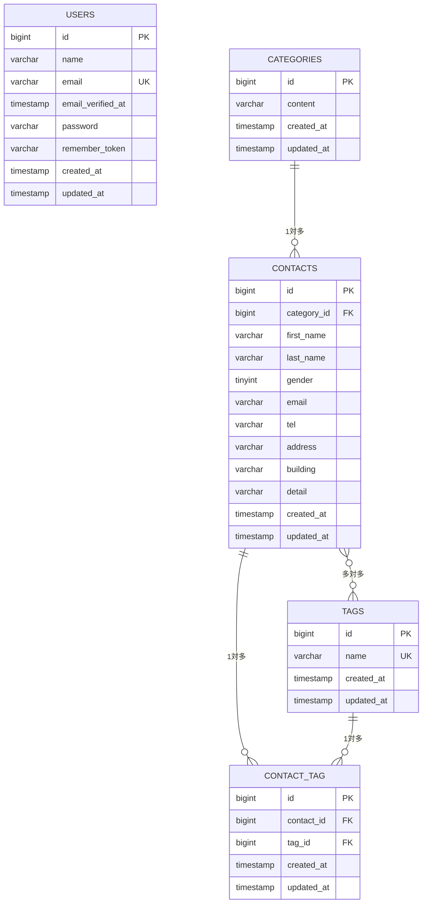

# COACHTECH お問い合わせフォーム

## 概要

一般ユーザーが利用できる公開お問い合わせフォームと、管理者がお問い合わせ内容を確認・管理できる管理画面を備えた Laravel アプリケーションです。

主な機能は以下のとおりです。

- 公開お問い合わせフォーム
- お問い合わせ確認画面
- お問い合わせ送信完了画面
- 管理者登録 / ログイン / ログアウト
- 管理画面でのお問い合わせ一覧表示
- お問い合わせ検索・ページネーション
- お問い合わせ詳細表示・削除
- タグの追加・編集・削除
- CSVエクスポート
- 公開APIによるお問い合わせ CRUD

---

## ER図



---

## 使用技術

- PHP 8.2
- Laravel 10.x
- Laravel Fortify
- MySQL 8.0
- Nginx
- Docker
- Laravel Sail
- phpMyAdmin
- Vite
- Tailwind CSS ^3.4.0
- Alpine.js

---

## 環境構築手順

### 1. Laravel プロジェクトの作成

Laravel 10.x を指定してプロジェクトを作成します。

```bash
docker run --rm \
  -u "$(id -u):$(id -g)" \
  -v "$(pwd):/var/www/html" \
  -w /var/www/html \
  -e COMPOSER_CACHE_DIR=/tmp/composer_cache \
  laravelsail/php82-composer:latest \
  composer create-project laravel/laravel:^10.0 contact-form-app
```

### 2. Laravel Sail のインストール

プロジェクト作成後、`contact-form-app` ディレクトリに移動し、Laravel Sail をインストールします。

```bash
cd contact-form-app
```

```bash
docker run --rm \
  -u "$(id -u):$(id -g)" \
  -v "$(pwd):/var/www/html" \
  -w /var/www/html \
  -e COMPOSER_CACHE_DIR=/tmp/composer_cache \
  laravelsail/php82-composer:latest \
  composer require laravel/sail --dev
```

MySQL 構成で Sail の設定ファイルを生成します。

```bash
docker run --rm \
  -u "$(id -u):$(id -g)" \
  -v "$(pwd):/var/www/html" \
  -w /var/www/html \
  -e COMPOSER_CACHE_DIR=/tmp/composer_cache \
  laravelsail/php82-composer:latest \
  php artisan sail:install --with=mysql
```

#### Apple Silicon Mac 利用時の補足

M1 / M2 / M3 Mac では、`sail up -d` 実行時に以下のエラーが発生する場合があります。

```text
no matching manifest for linux/arm64/v8
```

その場合は `compose.yaml` の `mysql` サービスに以下を追加してください。

```yaml
mysql:
    image: "mysql/mysql-server:8.0"
    platform: "linux/amd64"
    ports:
```

### 3. `.env` ファイルの設定

`.env` ファイルを開き、データベース接続情報が以下と一致していることを確認します。

```env
DB_CONNECTION=mysql
DB_HOST=mysql
DB_PORT=3306
DB_DATABASE=laravel
DB_USERNAME=sail
DB_PASSWORD=password
```

`DB_HOST` は `localhost` や `127.0.0.1` ではなく、Docker コンテナ名である `mysql` を指定します。

### 4. フロントエンドのセットアップ

#### 4-1. Sail コンテナ起動前提

以下のコマンドを実行する前に、必ず Sail コンテナが起動していることを確認してください。

#### 4-2. NPM 依存パッケージのインストール

```bash
./vendor/bin/sail npm install
```

#### 4-3. Tailwind CSS / Alpine.js のインストール

```bash
./vendor/bin/sail npm install -D tailwindcss@^3.4.0 postcss autoprefixer
```

```bash
./vendor/bin/sail npm install alpinejs
```

#### 4-4. 設定ファイルの生成

```bash
./vendor/bin/sail npx tailwindcss init -p
```

#### 4-5. `tailwind.config.js` の設定

`tailwind.config.js` を以下のように設定します。

```js
/** @type {import('tailwindcss').Config} */
export default {
    content: [
        "./resources/**/*.blade.php",
        "./resources/**/*.js",
        "./resources/**/*.vue",
    ],
    theme: {
        extend: {},
    },
    plugins: [],
};
```

#### 4-6. 提供リポジトリの `resources` ディレクトリと入れ替え

以下のリポジトリをクローンします。

```bash
git clone https://github.com/coachtech-prepared-file/Preparedblade-ConfirmationTest-ContactForm.git
```

````

その後、以下の手順で `resources` ディレクトリを入れ替えます。

1. プロジェクト内の `resources` フォルダを削除する
2. クローンしたリポジトリ内の `resources` フォルダをプロジェクト直下にコピーする

#### 4-7. Vite 開発サーバーの起動

```bash
./vendor/bin/sail npm run dev
````

`./vendor/bin/sail npm run dev` は起動したままにしてください。

### 5. phpMyAdmin の追加

`compose.yaml` を開き、`mysql` サービスの後に以下を追加してください。

```yaml
phpmyadmin:
    image: "phpmyadmin:latest"
    ports:
        - "${FORWARD_PHPMYADMIN_PORT:-8080}:80"
    environment:
        PMA_HOST: mysql
        PMA_USER: "${DB_USERNAME}"
        PMA_PASSWORD: "${DB_PASSWORD}"
    networks:
        - sail
    depends_on:
        - mysql
```

### 6. Sail の起動とエイリアス設定

Sail をバックグラウンドで起動します。

```bash
./vendor/bin/sail up -d
```

エイリアスを設定して `sail` コマンドで実行できるようにします。

```bash
echo "alias sail='[ -f sail ] && bash sail || bash vendor/bin/sail'" >> ~/.zshrc
```

bash を利用している場合はこちらです。

```bash
# echo "alias sail='[ -f sail ] && bash sail || bash vendor/bin/sail'" >> ~/.bashrc
```

シェルを再起動するか、新しいターミナルを開いてエイリアスを有効にします。

```bash
exec $SHELL
```

### 7. アプリケーションキーの生成

プロジェクトルートで以下を実行します。

```bash
sail artisan key:generate
```

### 8. データベースのマイグレーションと初期データ投入

テーブル作成と初期データ投入を実行します。

```bash
sail artisan migrate --seed
```

既存データベースをリセットしたい場合は以下を実行します。

```bash
sail artisan migrate:fresh --seed
```

---

## APIエンドポイント一覧

| メソッド | パス                         | 概要                                               |
| -------- | ---------------------------- | -------------------------------------------------- |
| GET      | `/api/v1/contacts`           | お問い合わせ一覧取得（検索・ページネーション対応） |
| GET      | `/api/v1/contacts/{contact}` | お問い合わせ詳細取得                               |
| POST     | `/api/v1/contacts`           | お問い合わせ新規作成                               |
| PUT      | `/api/v1/contacts/{contact}` | お問い合わせ更新                                   |
| DELETE   | `/api/v1/contacts/{contact}` | お問い合わせ削除                                   |

---

## 開発環境URL

- アプリケーション: `http://localhost`
- phpMyAdmin: `http://localhost:8080`

---

## 作成者

高山雄生
